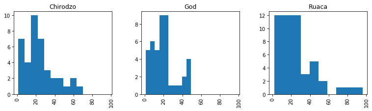

::::::::::::::::::::::::::::::::::::::: objectives

- Create simple plots using pandas
- Import pyplot from the matplotlib library
- Customise plots using pyplot

::::::::::::::::::::::::::::::::::::::::::::::::::

:::::::::::::::::::::::::::::::::::::::: questions

- How can I create visualisations of my data?

::::::::::::::::::::::::::::::::::::::::::::::::::

## Plotting in Python

There is a wide variety of ways to plot in Python, like many programming languages.
Some do more of the design work for you and others let you customize the look of the plots and all of the little details yourself.
[Pandas][pandas-web] has basic plots built into it that reduce the amount of syntax, if your data is already in a DataFrame.
[Matplotlib][matplotlib-web]. is a Python graphical library that can be used to produce a variety of different graph types,
it is fully controllable down to basic elements and includes a module `pylab` that is somewhere in between
(designed to feel like MATLAB plotting, if you happen to have done that before).

The Matplotlib library can be imported using any of the import techniques we have seen. As Pandas is generally imported
with `import pandas as pd`, you will find that Matplotlib is most commonly imported with `import matplotlib as plt` where 'plt' is the alias.

In addition to importing the library, in a Jupyter notebook environment we need to tell Jupyter that when we produce a
graph, we want it to be display the graph in a cell in the notebook just like any other results. To do this we use the `%matplotlib inline` directive.

Although we are using Matplotlib in this episode, Pandas can make use of several other graphical libraries available
from within Python such as [ggplot2][ggplot2-web] and [Seaborn][seaborn-web]. Seaborn has some very powerful features
and advanced plot types.  One of its most useful features is formatting.

## Plotting with Pandas

The Pandas library contains very tight integration with Matplotlib. There are functions in Pandas that
automatically call Matplotlib functions to produce graphs.

To plot with Pandas we have to import it as we have done in past episodes.
To tell Jupyter that when we produce a graph we want it to be displayed in a cell in the notebook just like any other results,
we use the `%matplotlib inline` directive. Without that we need to do a `show()` command.

```python
import pandas as pd
%matplotlib inline
```

We also need data to work with loaded into a DataFrame and it's helpful to look at a few rows to remember what's there.

We are going to use the dataset from the setup page, `SAFI_full_shortname.csv`. For the data to load, **make sure to
have that file in the same folder where your Jupyter notebook is running.** If the file is not in that folder, you
are going to have to type the full path.

```python
df = pd.read_csv("SAFI_full_shortname.csv")
df.head()
```

Next, we can plot the a histogram of a variable.

```python
df['years_liv'].hist()
```

{alt='Histogram of years lived spotlighting how to plot a variable with Pandas'}

We can change the number of bins to make it look how we would like, for example

```python
df['years_liv'].hist(bins=20)
```

We can also specify the column as a parameter and a groupby column with the `by` keyword.
there are a lot of keywords available to make it look better, we can see some of the most likely ones
(as decided by Pandas developers) by using <kbd>shift</kbd> + <kbd>tab<kbd> .

Lets try `layout`, `figsize`, and `sharex`.

```python
df.hist(column='years_liv',by='village',layout=(1,3),figsize=(12,3),sharex=True)
```

{alt='Three separate histograms depicting the number of years lived by village; Chirodzo, God, Ruaca'}

## Scatter plot

The scatter plot requires the x and y coordinates of each of the points being plotted. We can add a third dimension as different colors with the `c` argument.

```python
df.plot.scatter(x='gps_Latitude', y='gps_Longitude', c='gps_Altitude', colormap="viridis", figsize=[4,4])
```

{alt='png'}

:::::::::::::::::::::::::::::::::::::::  challenge

## Exercise

1. Make a scatter plot of `years_farm` vs `years_liv` and color the points by `buildings_in_compound`
2. Make a bar plot of the mean number of rooms per wall type

Compare the two graphs we have just drawn. How do they differ? Are the differences significant?

:::::::::::::::  solution

## Solution

Most importantly the data in the graphs is the same. There are cosmetic differences in the scale points in the x and y axis and in the width of the bars.

The width of the bars can be changed with a parameter in the 'bar' function

```python
plt.bar(range(len(s)), s, width = 0.5)   # the default width is 0.8
```


Extension: try plotting by wall and roof type?

:::::::::::::::::::::::::

:::::::::::::::  solution

## Solution

For the scatter plot:

```python
df.plot.scatter(x = 'years_liv', y = 'years_farm', c = 'buildings_in_compound', colormap = 'viridis')
```

{alt='png'}

For the barplot: we first need to calculate the mean value of rooms per wall type, then we can make the plot.

```python
rooms_mean = df.groupby('respondent_wall_type').mean()['rooms']
rooms_mean.plot.bar()
```

{alt='png'}


:::::::::::::::::::::::::

::::::::::::::::::::::::::::::::::::::::::::::::::

## Boxplot

A boxplot provides a simple representation of a variety of statistical qualities of a single set of data values.
A common use of the boxplot is to compare the statistical variations across a set of variables.

The variables can be an independent series or columns of a Dataframe using the Pandas plot method

```
df.boxplot(by ='village',column=['buildings_in_compound'])
```
{:.language-python}

{alt='png'}

We can make it look prettier with Seaborn, much more easily than fixing components manually with Matplotlib.
[Seaborn](https://seaborn.pydata.org) is a Python data visualization library based on Matplotlib.
It provides a high-level interface for drawing attractive and informative statistical graphics.
Seaborn comes with Anaconda; to make it available in our Python session we need to import it.

```python
import seaborn as sns
sns.boxplot(data = df, x = 'village', y = 'buildings_in_compound')
```

{alt='png'}

We can also draw linear models in a plot using `lmplot()` from `seaborn`, e.g. for `years_farm` vs `years_liv` per `village`.

```python
sns.lmplot(x='years_farm', y='years_liv',data=df,hue='village')
```

{alt='Plot showing years lived and years farmed by village to spotlight the use of linear models'}

In general, most graphs can be broken down into a series of elements which, although typically related in some way,
can all exist independently of each other. This allows us to create the graph in a rather piecemeal fashion.

The labels (if any) on the x and y axis are independent of the data values being represented. The title and the legend
are also independent objects within the overall graph.

In Matplotlib you create the graph by providing values for all of the individual components you choose to include.
When you are ready, you call the `show` function.

Using this same approach, we can plot two sets of data on the same graph.

We will use a scatter plot to demonstrate some of the available features.

## Fine-tuning figures with Matplotlib

If we want to do more advanced or lower level things with our plots, we need to use Matplotlib directly,
not through Pandas. First we need to import it.

## Customising our plots with Matplotlib

We can further customise our plots with Matplotlib directly. First we need to import it.
The Matplotlib library can be imported using any of the import techniques we have seen.
As Pandas is generally imported with `import pandas as pd`, you will find that `matplotlib` is most commonly imported
with `import matplotlib.pyplot as plt` where `plt` is the alias.
For demonstration purposes, we are going to use randomly generated data, using the NumPy library (aliased here as `np`).

```python
import numpy as np
import pandas as pd
import matplotlib.pyplot as plt

# Generate some date for 2 sets of points.
x1 = pd.Series(np.random.rand(20) - 0.5)
y1 = pd.Series(np.random.rand(20) - 0.5)

x2 = pd.Series(np.random.rand(20) + 0.5)
y2 = pd.Series(np.random.rand(20) + 0.5)


# Add some features
plt.title('Scatter Plot')
plt.ylabel('Range of y values')
plt.xlabel('Range of x values')

# plot the points in a scatter plot
plt.scatter(x1, y1, c='red', label='Red Range')  # 'c' parameter is the colour and 'label' is the text for the legend
plt.scatter(x2, y2, c='blue', label='Blue Range')

plt.legend(loc=4)  # the locations 1,2,3 and 4 are top-right, top-left, bottom-left and bottom-right
# Show the graph with the two sets of points
plt.show()
```

In the call to the `scatter` method, the `label` parameter values are used by the *legend*.
The `c` or `color` parameter can be set to any color Matplotlib recognises. Full details of the available colours are available in the [Matplotlib](https://matplotlib.org/api/colors_api.html) website. The [markers](https://matplotlib.org/api/markers_api.html) section will tell you what markers you can use instead of the default 'dots'. There is also an `s` (size) parameter which allows you to change the size of the marker.

:::::::::::::::::::::::::::::::::::::::  challenge

## Exercise

In the scatterplot the s parameter determines the size of the dots. s can be a simple numeric value, say s=100, which will produce dots all of the same size. However, you can pass a list of values (or a Pandas Series) to provide sizes for the individual dots. This approach is very common as it allows us to provide an extra variable worth of information on the graph.

1. Modify the code we used for the scatter plot to include a size value for each of the points in the series being plotted.
  (The downside is that some of the smaller dots may be completely covered by the larger dots. To try and highlight when this has happened, we can change the opacity of the dots.)

2. Find out which parameter controls the opacity of the dots (clue - it is not called opacity), add it to you code and set it > to a reasonable value.

:::::::::::::::  solution

## Solution

```python
# Generate some data for 2 sets of points.
# and additional data for the sizes - suitably scaled
x1 = pd.Series(np.random.rand(20) - 0.5)
y1 = pd.Series(np.random.rand(20) - 0.5)
z1 = pd.Series(np.random.rand(20) * 200)

x2 = pd.Series(np.random.rand(20) + 0.5)
y2 = pd.Series(np.random.rand(20) + 0.5)
z2 = pd.Series(np.random.rand(20) * 200)

# Add some features
plt.title('Scatter Plot')
plt.ylabel('Range of y values')
plt.xlabel('Range of x values')

# plot the points in a scatter plot
plt.scatter(x1, y1, c='red', label='Red Range', s=z1, alpha=0.5)  # 's' parameter is the dot size
plt.scatter(x2, y2, c='blue', label='Blue Range', s=z2, alpha=0.5) # 'alpha' is the opacity

plt.legend(loc=4)
plt.show()
```

:::::::::::::::::::::::::

::::::::::::::::::::::::::::::::::::::::::::::::::

Internally the Pandas 'plot' method has called the 'bar' method of Matplotlib and provided a set of parameters, including the pandas.Series s to generate the graph.

We can use Matplotlib directly to produce a similar graph. In this case we need to pass two parameters, the number of bars we need and the Pandas Series holding the values.

Let's redo the boxplot we did above:

```python
df.boxplot(column = 'buildings_in_compound', by = 'village')
```

{alt='png'}

The automatic title of the plot does not look good, we are missing a title for the y-axis and we do not need the extra x-axis title. We can also remove the gridlines. Let's fix these things using functions from `plt`. Note: all the adjustments for the plot have to go into the same notebook cell together with the plot statement itself.

```python
df.boxplot(column = 'buildings_in_compound', by = 'village')
plt.suptitle('') # remove the automatic title
plt.title('Buildings in compounds per village')   # add a title
plt.ylabel('Number of buildings')   # add a y-axis title
plt.xlabel('')   # remove the x-axis title
plt.grid(None)   # remove the grid lines
```

{alt='png'}

In general most graphs can be broken down into a series of elements which, although typically related in some way, can all exist independently of each other. This allows us to create the graph in a rather piecemeal fashion.
The labels (if any) on the x and y axis are independent of the data values being represented. The title and the legend are also independent objects within the overall graph.
In `matplotlib` you create the graph by providing values for all of the individual components you choose to include.

## Saving a graph

If you wish to save your graph as an image you can do so using the `plt.savefig()` function. The image can be saved as a pdf, jpg or png file by changing the file extension. `plt.savefig()` needs to be called at the end of all your plot statements in the same notebook cell.

```python
df.boxplot(column = 'buildings_in_compound', by = 'village')
plt.suptitle('') # remove the automatic title
plt.title('Buildings in compounds per village')   # add a title
plt.ylabel('Number of buildings')   # add a y-axis title
plt.xlabel('')   # remove the x-axis title
plt.grid(None)   # remove the grid lines
plt.savefig('safi_boxplot_buildings.pdf')   # save as pdf file
plt.savefig('safi_boxplot_buildings.png', dpi = 150)  # save as png file, some extra arguments are provided
```

In general most graphs can be broken down into a series of elements which, although typically related in some way, can
all exist independently of each other. This allows us to create the graph in a rather piecemeal fashion.

The labels (if any) on the x and y axis are independent of the data values being represented.
The title and the legend are also independent objects within the overall graph.

In Matplotlib you create the graph by providing values for all of the individual components you choose to
include. When you are ready, you call the `show` function.

Using this same approach we can plot two sets of data on the same graph. We will use a scatter plot to
demonstrate some of the available features.

:::::::::::::::::::::::::::::::::::::::  challenge

## Exercise

Revisit your favorite plot we've made so far, or make one with your own data then:

1. add axes labels
2. add a title
3. add a legend
4. save it in two different formats

extension: try plotting by wall and roof type!

::::::::::::::::::::::::::::::::::::::::::::::::::

[pandas-web]: https://pandas.pydata.org/
[matplotlib-web]: https://matplotlib.org/
[ggplot2-web]: https://ggplot2.tidyverse.org/
[seaborn-web]: https://seaborn.pydata.org/


:::::::::::::::::::::::::::::::::::::::: keypoints

- Graphs can be drawn directly from Pandas, but it still uses Matplotlib
- Different graph types have different data requirements
- Graphs are created from a variety of discrete components placed on a 'canvas', you don't have to use them all

::::::::::::::::::::::::::::::::::::::::::::::::::


