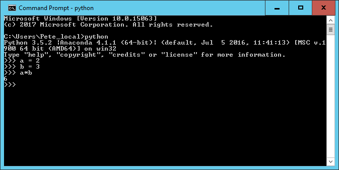

## Introducing the Python programming language

Python is a general purpose programming language. It is an interpreted language which makes it suitable for rapid development and proto-typing of programming segments or complete small programs
Python’s main advantages:

* Open Source software, supported by [Python Software Foundation](https://www.python.org/psf/)
* Available on all major platforms (Windows, macOS, Linux )
* It is relatively straightforward for new programmers to pick up the basics 
* It is well structured which aids readability
* It is extensible and is supported by a large community who provide a comprehensive range of 3rd party packages 

## Interpreted v compiled languages

In any programming language, before code is run, the code must be translated into ‘machine code’. It is the machine code which is executed and produces results. In a language like C++ you code is translated into machine code and stored in a separate file. You then execute the machine code from the file as a separate step. If you intend to run the same code many times this is efficient as you only have to do the translation once.

On the other hand, if you are just trying stuff out, experimenting, then your code will have changed almost every time you run it so the benefits of compiled code is lost.

This is where interpreted languages have the advantage. You don’t need a complete program to ‘run’ what has been written so far and see the results.  This rapid proto-typing is helped further by use of a system called REPL.

## REPL

REPL is an acronym which stands for Read, Execute, Print and Loop. 

REPL allows you to write single statements of code and have them executed and if there are any results to show, they are displayed and then the interpreter loops back to the beginning and waits for the next program statement.

In the example above, two variables (a and b) have been created, assigned values (2 and 3) and then multiplied together.  

Every time you hit ‘enter’ the line is interpreted. The assignment statements don’t produce any output so you just get the standard ‘>>>’ prompt. 

For the ‘a*b’ statement (it is more of an expression than a statement), because the result is not being assigned to a variable, the REPL displays the result of the calculation on screen and then waits for the next input.

The REPL system makes it very easy to try out small chunks of code.

You are not restricted to single line statements. If the Python interpreter decides that what you have written on a line cannot be a complete statement it will give you a continuation prompt of ‘…’ until you complete the statement.

## Introducing Jupyter notebooks

Jupyter is the successor to a system called IPython.  Originally IPython was a notebook system only for Python code. Now it is available for a variety of other languages as well so it was appropriate to change the name. We will be using Jupyter notebooks only for Python code.
We access the Jupyter notebook system a web interface which we access from a web browser.  Whwn the Jupter system is started (see setup link) from the command line prompt your browser should start automatically and look something like this;

When you create a notebook from the `New` option the new notebook will be displayed in a new browser and look like this.

Initially the notebook has no name other than ‘Untitled’. If you click on ‘Untitled’ you will be given the option of changing the name to whatever you want.

The notebook is divided up into `cells`. Initially there will be a single input cell.

You can type Python code directly into the cell. You can split the code across several lines as needed. Unlike the REPL we looked at before, the code is not interpreted line by line. To interpret the code in a cell you need to click the run button in the toolbar or from the `Cell` menu option. At which point all of the code in that cell will be executed. 

The results are shown in a separate `Out` cell immediately below. A new input cell is created for you automatically

When a cell is `Run` it is given a number along with the corresponding output cell.  If you have a notebook with many cells in it you can run the cells in any order or run the same cell many times. The number of the cells increments so you can always tell the order in which they were run.

Although there is an option to do so on the toolbar, you do not have to manually save the notebook. This is done automatically by the Jupyter system.

Not only is the contents of the `In` cells saved, but also the `Out` cells.  This allows you to create complete documents with both you code and the output of the code in a single place.  You can also change the cell type of a cell from Python code to  `Markdown` using the `Cell | Cell Type` option. `Markdown’ is a simple formatting system which allows you to create documentation for your code, again all within the same notebook structure.

The Notebook itself is stored as a JSON file with an ‘.ipynb’ extension. These JSON files are text based and can be exported  and imported into another Jupyter system. This allows you to share you code, results and documentation with others.

