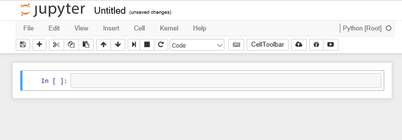

## Introducing the Python programming language

Python is a general-purpose programming language. It is an interpreted language,
which makes it suitable for rapid development and prototyping of programming segments or complete 
small programs.

Python's main advantages:

* Open-source software, supported by [Python Software
  Foundation](https://www.python.org/psf/)
* Available on all major platforms (Windows, macOS, Linux)
* It is a good language for new programmers to learn due to its straightforward,
  object-oriented style
* It is well-structured, which aids readability
* It is extensible (i.e. modifiable) and is supported by a large community who
  provide a comprehensive range of 3rd party packages

## Interpreted vs. compiled languages

In any programming language, the code must be translated into "machine code"
before running it. It is the machine code which is executed and produces
results. In a language like C++ your code is translated into machine code and
stored in a separate file, in a process referred to as **compiling** the code.
You then execute the machine code from the file as a separate step. This is
efficient if you intend to run the same machine code many times as you only 
compile it once and it is very fast to run the compiled machine code.

On the other hand, if you are experimenting, then your
code will change often, and you would have to compile it again every time before
the machine can execute it. This is where **interpreted** languages have the
advantage. You don't need a complete compiled program to "run" what has been
written so far and see the results. This rapid prototyping is helped further by
use of a system called REPL.

## REPL

**REPL** is an acronym which stands for Read, Evaluate, Print and Loop.

REPL allows you to write single statements of code, have them executed, and if
there are any results to show, they are displayed and then the interpreter loops
back to the beginning and waits for the next program statement.

In the example above, two variables `a` and `b` have been created, assigned to values
`2` and `3`, and then multiplied together.  

Every time you press <kbd>Return</kbd>, the line is interpreted. The assignment statements don't produce any 
output so you get only the standard `>>>` prompt.

For the `a*b` statement (it is more of an expression than a statement), because
the result is not being assigned to a variable, the REPL displays the result of
the calculation on screen and then waits for the next input.

The REPL system makes it very easy to try out small chunks of code.

You are not restricted to single line statements. If the Python interpreter
decides that what you have written on a line cannot be a complete statement it
will give you a continuation prompt of `...` until you complete the statement.

## Introducing Jupyter notebooks

[**Jupyter**](http://jupyter.org/) originates from IPython, an effort to make Python
development more interactive. Since its inception, the scope of the project
has expanded to include **Ju**lia, **Pyt**hon, and **R**, so the name was changed to "Jupyter"
as a reference to these core languages. Today, Jupyter supports even more
languages, but we will be using it only for Python code. Specifically, we will
be using **Jupyter notebooks**, which allows us to easily take notes about
our analysis and view plots within the same document where we code. This
facilitates sharing and reproducibility of analyses, and the notebook interface
is easily accessible through any web browser. Jupyter notebooks are started
from the terminal using the following command:

~~~
$ jupyter notebook
~~~
{: .language-bash}

Your browser should start automatically and look
something like this:

When you create a notebook from the *New* option, the new notebook will be displayed in a new 
browser tab and look like this.

Initially the notebook has no name other than 'Untitled'. If you click on 'Untitled' you will be 
given the option of changing the name to whatever you want.

The notebook is divided into **cells**. Initially there will be a single input cell marked by `In 
[ ]:`.

You can type Python code directly into the cell. You can split the code across
several lines as needed. Unlike the REPL we looked at before, the code is not
interpreted line by line. To interpret the code in a cell, you can click the
*Run* button in the toolbar or from the *Cell* menu option, or use keyboard
shortcuts (e.g., <kbd>Shift</kbd>+<kbd>Return</kbd>). All of the code in that cell will then be
executed.

The results are shown in a separate `Out [1]:` cell immediately below. A new input
cell (`In [ ]:`) is created for you automatically.

When a cell is run, it is given a number along with the corresponding output
cell. If you have a notebook with many cells in it, you can run the cells in any
order and also run the same cell many times. The number on the left-hand side of
the input cells increments, so you can always tell the order in which they were
run. For example, a cell marked `In [5]:` was the fifth cell run in the sequence.

Although there is an option to do so on the toolbar, you do not have to manually
save the notebook. This is done automatically by the Jupyter system.

Not only are the contents of the `In [ ]:` cells saved, but so are the `Out [ ]:` cells.
This allows you to create complete documents with both your code and the output
of the code in a single place.  You can also change the cell type from
Python code to Markdown using the *Cell > Cell Type* option. [**Markdown**](https://en.wikipedia.org/wiki/Markdown) is
a simple formatting system which allows you to create documentation for your
code, again all within the same notebook structure.

The notebook itself is stored as specially-formatted text file with an `.ipynb` 
extension. These files can be opened and run by others with Jupyter installed. This allows you to 
share your code inputs, outputs, and
Markdown documentation with others. You can also export the notebook to HTML, PDF, and
many other formats to make sharing even easier.
