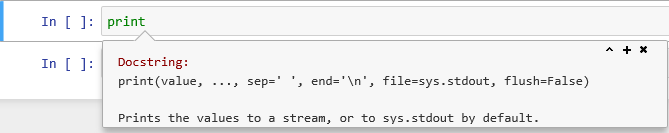

## Using the Jupyter environment

### New cells
From the insert menu item, you can insert a new cell anywhere in the notebook either above or below the current cell. You can also use the `+` button on the toolbar to insert a new cell below.

### Change cell type

By default, new cells are created as code cells. From the cell menu item, you can change the type of a cell from code to Markdown. Markdown is a markup language for formatting text, it has much of the power of HTML, but is specifically designed to be human-readable as well. You can use Markdown cells to insert formatted textual explanation and analysis into your notebook. For more information about Markdown, check out these resources:
 -  [Jupyter Notebook Markdown Docs](http://jupyter-notebook.readthedocs.io/en/stable/examples/Notebook/Working%20With%20Markdown%20Cells.html)
 - [Markdown - a Visual Guide](https://beegit.com/markdown-cheat-sheet)
 - [Mastering Markdown from Github](https://guides.github.com/features/mastering-markdown/)
 - [Markdown official open source project](https://daringfireball.net/projects/markdown/)

### Hiding output

When you run cells of code the output is displayed immediately below the cell. In general, this is convenient. The output is associated with the cell that produced it and remains a part of the notebook. So, if you copy or move the notebook the output stays with the code.

However, lots of output can make the notebook look cluttered and more difficult to move around. There is an option available from the `cell` menu item to 'toggle' or 'clear' the output associated either with an individual cell or all cells in the notebook.

## Creating variables and assigning values

### Variables and Types

In Python variables are created when you first assign values to them.

~~~
a = 2
b = 3.142
~~~
{: .language-python}

All variables have a data type associated with them.
The data type is an indication of the type of data contained in a variable.
If you want to know the type of a variable you can use the built-in `type()` function.

~~~
print(type(a))
print(type(b))
s = "Hello World"
print(type(s))
~~~
{: .language-python}

~~~
<class 'int'>
<class 'float'>
<class 'str'>
~~~
{: .output}

There are many more data types available, a full list is available in the [Python documentation](https://docs.python.org/3/library/datatypes.html).
We will be looking at a few of them later.

We need to use Python’s built-in `print()` function, which displays formatted text, because by default only the last output from a cell is displayed.

## Arithmetic operations

For now, we will stick with the numeric types and do some arithmetic.

All the usual arithmetic operators are available.

In the examples below we introduce the Python comment symbol `#`.
Anything to the right of the `#` symbol is treated as a comment. To a large extent using Markdown cells in a notebook reduces the need for comments in the code in a notebook, but occasionally they can be useful.

~~~
print("a =", a, "and b =" , b)
print(a + b)      # addition
print(a * b)      # multiplication
print(a - b)      # subtraction
print(a / b)      # division
print(b ** a)     # exponentiation
print(a % b)      # modulus - returns the remainder
print(2 * a % b)  # modulus - returns the remainder
~~~
{: .language-python}

~~~
a = 2 and b = 3.142
5.1419999999999995
6.284
-1.142
0.6365372374283896
9.872164
2.0
0.8580000000000001
~~~
{: .output}

In the first example above, we pass four different parameters to the first call of `print()`, each separated by a comma. A string `"a = "`, followed by the variable `a`, followed by the string `"b = "` and then the variable `b`. The output is what you would have probably guessed.

All of the other calls to `print()` are only passed a single parameter. Although it may look like two or three, the expressions are evaluated first, and it is only the single result which is seen as the parameter value and printed.

In the last expression, `a` is multiplied by two and then the modulus of the result is taken. Had we wanted to calculate a % b and then multiply the result by two we could have done so by using parentheses to make the order of calculation clear.

When we have more complex arithmetic expressions, we can use parentheses to be explicit about the order of evaluation:

~~~
print("a =", a, "and b =" , b)
print(a + 2*b)    # add a to two times b
print(a + (2*b))  # same thing but explicit about order of evaluation
print((a + b)*2)  # add a and b and then multiply by two
~~~
{: .language-python}

~~~
a = 2 and b = 3.142
8.283999999999999
8.283999999999999
10.283999999999999
~~~
{: .output}

Arithmetic expressions can be arbitrarily complex, but remember people have to read and understand them as well.

> ## Exercise
>
> 1. Create a new cell and paste into it the assignments to the variables a and b and the contents of the code cell above with all of the print statements. Remove all of the calls to the print function so you only have the expressions that were to be printed and run the code. What is returned?
>
> 2. Now remove all but the first line (with the 4 items in it) and run the cell again. How does this output differ from when we used the print function?
>
> 3. Practice assigning values to variables using as many different operators as you can think of.
>
> 4. Create some expressions to be evaluated using parentheses to enforce the order of mathematical operations that you require
>
>
> > ## Solution
> >
> > 1. Only the last result is printed.
> > 2. The 4 'items' are printed by the REPL, but not in the same way as the print statement. The items in quotes are treated as separate strings, for the variables a and b the values are printed. All four items are treated as a 'tuple' which are shown in parentheses, a tuple is another data type in Python that allows you to group things together and treat as a unit. We can tell that it is a tuple because of the `()`
> >
> > A complete set of Python operators can be found in the [official documentation](https://docs.python.org/3.5/library/operator.html) . The documentation may appear a bit confusing as it initially talks about operators as functions whereas we generally use them as 'in place' operators. Section 10.3.1 provides a table which list all of the available operators, not all of which are relevant to basic arithmetic.
> >
> {: .solution}
{: .challenge}

## Using built-in functions

Python has a reasonable number of built-in functions. You can find a complete list in the [official documentation](https://docs.python.org/3/library/functions.html).

Additional functions are provided by third party packages which we will look at later in the lesson.

For any function, a common question to ask is: What parameters does this function take?

To answer this from Jupyter, you can type the function name and then type `shift`+`tab` and a pop-up window will provide you with various details about the function including the parameters.

> ## Exercise
>
> Find out what parameters can be provided for the `print()` function.
>
> > ## Solution
> > Type 'print' into a code cell and then type `shift`+`tab`. The following pop-up should appear.
> >
> > 
> >
> >
> {: .solution}
{: .challenge}

## Getting Help for Python

You can get help for any Python function by using the help function. It takes a single parameter, which is the name of the function you want the help for.

~~~
help(print)
~~~
{: .language-python}

~~~
Help on built-in function print in module builtins:

print(...)
    print(value, ..., sep=' ', end='\n', file=sys.stdout, flush=False)

    Prints the values to a stream, or to sys.stdout by default.
    Optional keyword arguments:
    file:  a file-like object (stream); defaults to the current sys.stdout.
    sep:   string inserted between values, default a space.
    end:   string appended after the last value, default a newline.
    flush: whether to forcibly flush the stream.
~~~
{: .output}

There is a great deal of Python help and information as well as code examples available from the internet.  One popular site is [stackoverflow](https://stackoverflow.com/tags) which specialises in providing programming help. They have dedicated forums not only for Python but also for many of the popular third party Python packages. They also provide code examples to illustrate answers to questions.

You can also get answers to your queries by entering your question (or selected keywords) into any search engine.

A couple of things you may need to be wary of: There are currently 2 versions of Python in use, in most cases code examples will run in either, but there are some exceptions. Secondly, some replies may assume a deeper knowledge of Python than you currently have, making the answers difficult to follow. But for any given question there will be a whole range of suggested solutions so you can always move on to the next.

## Data types and how Python uses them

### Changing data types
The  data type of a variable is assigned when you give a variable a value as we did above. If you re-assign the value of a variable, you can change the data type.

You can also explicitly change the type of a variable by `casting` it using an appropriate Python built-in function. In this example we have changed a `string` to a `float`.

~~~
a = "3.142"
print(type(a))
a = float(a)
print(type(a))
~~~
{: .language-python}

~~~
<class 'str'>
<class 'float'>
~~~
{: .output}

Although you can always change an `integer` to a `float`, if you change a `float` to an `integer` then you can lose part of the value of the variable, and you won't get an error message.

~~~
a = 3.142
print(type(a))
a = 3
print(type(a))
a = a*1.0
print(type(a))
a = int(a)
print(type(a))
a = 3.142
a = int(a)
print(type(a))
print(a)
~~~
{: .language-python}

~~~
<class 'float'>
<class 'int'>
<class 'float'>
<class 'int'>
<class 'int'>
3
~~~
{: .output}

In some circumstances explicitly converting a data type makes no sense; for example, you cannot change a string with alphabetic characters into a number.

~~~
b = "Hello World"
print(type(b))

b = int(b)
print(type(b))
~~~
{: .language-python}

~~~
<class 'str'>
---------------------------------------------------------------------------
ValueError                                Traceback (most recent call last)
<ipython-input-8-9f5f81a470f9> in <module>()
      2 print(type(b))
      3
----> 4 b = int(b)
      5 print(type(b))

ValueError: invalid literal for int() with base 10: 'Hello World'
~~~
{: .output}

## Strings

A string is a simple data type which holds a sequence of characters.

Strings are placed in quotes when they are being assigned, but the quotes don't count as part of the string value.

If you need to use quotes as part of your string you can choose to use either single or double quotes to indicate the start and end of the string.

~~~
mystring = "Hello World"
print(mystring)

name = "Peter"
mystring = 'Hello, ' + name + ', how are you?'
print(mystring)

name = "Peter"
mystring = 'Hello, this is ' + name + "'s code"
print(mystring)
~~~
{: .language-python}

~~~
Hello World
Hello, Peter, how are you?
Hello, this is Peter's code
~~~
{: .output}

## String functions

There are a variety of Python functions available for use with strings. A string in Python is an example of an object. An object is something which has `data` (the contents of the string) and `methods` (or a special type of `functions`). Although `methods` and `functions` are very similar in practice, there is a difference in the way you call them.

One typical bit of information you might want to know about a string is its length. For this we use the `len()` function. For almost anything else you might want to do with strings, there is a method.

~~~
mystring = "Hello World"
print(len(mystring))
~~~
{: .language-python}

~~~
11
~~~
{: .output}

[The official documentation](https://docs.python.org/3/tutorial/classes.html) says: _A method is a function that “belongs to” an object. (In Python, the term method is not unique to class instances: other object types can have methods as well. For example, list objects have methods called append, insert, remove, sort, and so on. [...]_ '

If you want to see a list of all of the available methods for a string (or any other object) you can use the `dir()` function.

~~~
print(dir(mystring))
~~~
{: .language-python}

~~~
['__add__', '__class__', '__contains__', '__delattr__', '__dir__', '__doc__', '__eq__', '__format__', '__ge__', '__getattribute__', '__getitem__', '__getnewargs__', '__gt__', '__hash__', '__init__', '__iter__', '__le__', '__len__', '__lt__', '__mod__', '__mul__', '__ne__', '__new__', '__reduce__', '__reduce_ex__', '__repr__', '__rmod__', '__rmul__', '__setattr__', '__sizeof__', '__str__', '__subclasshook__', 'capitalize', 'casefold', 'center', 'count', 'encode', 'endswith', 'expandtabs', 'find', 'format', 'format_map', 'index', 'isalnum', 'isalpha', 'isdecimal', 'isdigit', 'isidentifier', 'islower', 'isnumeric', 'isprintable', 'isspace', 'istitle', 'isupper', 'join', 'ljust', 'lower', 'lstrip', 'maketrans', 'partition', 'replace', 'rfind', 'rindex', 'rjust', 'rpartition', 'rsplit', 'rstrip', 'split', 'splitlines', 'startswith', 'strip', 'swapcase', 'title', 'translate', 'upper', 'zfill']
~~~
{: .output}

Methods starting with `__` are special or magic methods which are not normally used. Some examples of methods are given below. We will use others once we start reading files.

~~~
myString = "The quick brown fox"

print(myString.startswith("The"))
print(myString.find("The"))        # notice that string positions start with 0 like all indexing in Python
print(myString.upper())            # The contents of myString is not changed, if you wanted an uppercase version
print(myString)                    # you would have to assign it to a new variable
~~~
{: .language-python}

~~~
True
0
THE QUICK BROWN FOX
The quick brown fox
~~~
{: .output}

Methods starting with _is_ return a Boolean value (True or False).

~~~
print(myString.isalpha())
~~~
{: .language-python}

~~~
False
~~~
{: .output}

The example above returns False, because the space character is not considered to be an Alphanumeric value.

In the example below, we can use the `replace` method to remove spaces and then check to see if the result is alphanumeric by using the method `isalpha`.
Methods can be "chained", which means performing one method after another, from left to right, without the need to save all intermediate variables. If you would prefer not to chain methods, you would need to save each intermediate value to a new variable.
~~~
print(myString.replace(" ","").isalpha())
~~~
{: .language-python}

~~~
True
~~~
{: .output}

For example, the following is equivalent to the above, but requires an extra line of code and an extra variable:
~~~
mystring_clean = myString.replace(" ","")
print(mystring_clean.isalpha())
~~~
{: .language-python}

~~~
True
~~~
{: .output}

If you need to refer to a specific element (character) in a string,
you can do so by specifying the `index` of the character in between square brackets `[]`
In Python, indexes begin with `0` (for a visual, please see 
[Strings and Character Data in Python: String Indexing](https://realpython.com/python-strings/#string-indexing) 
or [9.4. Index Operator: Working with the Characters of a String](https://runestone.academy/runestone/books/published/thinkcspy/Strings/IndexOperatorWorkingwiththeCharactersofaString.html)).
You can also use indexing to select a substring of the whole string.

~~~
myString = "The quick brown fox"

print(myString[0])
print(myString[12])
print(myString[18])

print(myString[0:3])
print(myString[0:])        # from index 0 to the end
print(myString[:9])        # from the beginning to one before index 9
print(myString[4:9])
~~~
{: .language-python}

~~~
T
o
x
The
The quick brown fox
The quick
quick
~~~
{: .output}

## Basic Python data types

So far, we have seen three basic Python data types: Integer, Float, and String. There is another basic data type: Boolean. Boolean variables take the values `True` or `False` (remember that Python is case-sensitive, so be careful with spelling!). Boolean variables are a good way of coding anything that has a binary range (e.g., yes/no), because it's a type that computers know how to work with, as we will see soon.

~~~
print(False)
bool_val_t = True
print(type(bool_val_t))
print(bool_val_t)
print(true)
~~~
{: .language-python}

~~~
False
<class 'bool'>
True

NameError   Traceback (most recent call last)
<ipython-input-115-b5911eeae48b> in <module>
----> 1 print(true)
      2 print(false)

NameError: name 'true' is not defined
~~~
{: .output}

Following two lines of code will generate error because Python is case-sensitive. We need to use 'True' instead of 'true' and 'False' instead of 'false'.

We can also get Boolean values by using comparison operators, the basic ones in Python are `==` for "equal to", `!=` for "not equal to", and `>`, `<`, or `>=`, `<=`.

~~~
print('hello' == 'HELLO')
print('hello' is 'hello')
print(3 != 77)
print(1 < 2)
print('four' > 'three')
~~~
{: .language-python}

~~~
False
True
True
True
False
~~~
{: .output}

> ## Exercise
>
> Imagine you are considering different ways of representing a boolean value in your data set and you need to see how python will behave based on the different choices. Fill in the blanks using the built-in functions we've seen so far to test how Python interprets the different values.
>
> ~~~
> bool_val1 = 'TRUE'
> print('read as type ',___(bool_val1))
> print('value when cast to bool',___(bool_val1))
>
> bool_val2 = 1
> print('read as type ',___(bool_val2))
> print('value when cast to bool',___(bool_val2))
>
> bool_val3 = 0
> print('read as type ',___(bool_val3))
> print('value when cast to bool',___(bool_val3))
>
> ~~~
> {: .language-python}
>
> > ## Solution
> >
> >  The number 0 is interpreted as `False`, and non-empty strings or non-zero numbers are interpreted as `True`.
> >
> {: .solution}
{: .challenge}

## Structured data types

A _structured_ data type is made up of a combination of the base data types (e.g., Integer, String, Boolean) in a well defined but potentially (arbitrarily) complex way.

### Lists

A list is a set of values of any type, separated by commas and delimited by square brackets ('[' and ']').

~~~
list1 = [6, 54, 89.23]
print(list1)
print(type(list1))

myname = "Peter"
list2 = ["Hello", myname, 'how are you today?']
print(list2)
myname = "Fred"
print(list2)
print(type(list2))

list3 = [6, 5.4, "numbers", True]
print(list3)
print(type(list3))
~~~
{: .language-python}

~~~
[6, 54, 89.23]
<class 'list'>
['Hello', 'Peter', 'how are you today?']
['Hello', 'Peter', 'how are you today?']
<class 'list'>
[6, 5.4, 'numbers', True]
<class 'list'>
~~~
{: .output}

> ## Exercise
> Use an _index_ to print the last number in the list below. Then print the odd numbers that are in the list.
> ~~~
> num_list = [4, 5, 6, 11]
>
> last_num_in_list = num_list[____]
> print(last_num_in_list)
>
> odd_from_list = 
> print(odd_from_list)
> ~~~
> {: .language-python}
> > ## Solution
> > ~~~
> > # One solution: Basic way of solving this exercise using core Python language
> > last_num_in_list = num_list[-1] # Why is this a "better" solution than num_list[3]?
> > print(last_num_in_list)
> >
> > odd_from_list = [num_list[1], num_list[3]]
> > print(odd_from_list)
> >
> > # Other solutions: There is usually more than one way of doing the same task. Some might be more _generalizable_ or robust than others. Once we learn more advanced Python, we will be able to write more advanced and error-proof code to print odd numbers, such as the following:
> > # Use the third party package called `numpy`
> > import numpy as np
> > num_list = [4, 5, 6, 11]
> >
> > # Convert `num_list` list to an advanced data structure: `numpy array`
> > num_list_np_array = np.array(num_list)
> >
> > # Use the "modulo" operator we learned about above to find the indexes of the numbers in the list that have remainder = 1 after dividing by 2
> > odd_ixs = num_list_np_array % 2 == 1 
> > print(odd_ixs)
> > 
> > # Now, use a concept called `masking` to index into the numerical array
> > odd_from_list = num_list_np_array[num_list_np_array % 2 == 1]
> > print(odd_from_list)
> > ~~~
> > {: .language-python}
> {: .solution}
{: .challenge}

### The range function

In addition to explicitly creating lists as we have above it is very common to create and populate them automatically using the `range` function in combination with the `list` function

~~~
list4 = list(range(5))
print(list4)
~~~
{: .language-python}

~~~
[0, 1, 2, 3, 4]
~~~
{: .output}

Unless explicitly specified, `range` returns a sequence which starts at 0, counts up by one, and ends one number _before_ the value of the provided parameter. This can be a cause of confusion. `range(5)` above does indeed have 5 values, but rather than being `1,2,3,4,5` which you might have expected, they are `0,1,2,3,4`.

If you want different sequences, you can modify the behavior of the `range()` function by using additional parameters.

~~~
list5 = list(range(1, 9))
print(list5)
list6 = list(range(2, 12, 2))
print(list6)
~~~
{: .language-python}

~~~
[1, 2, 3, 4, 5, 6, 7, 8]
[2, 4, 6, 8, 10]
~~~
{: .output}

When you specify three parameters, as we have for `list6`, the first will be the first value in the list, the second will be last value of the list plus one, and the third parameter is the step or interval by which to count. So, for example, `list6` returns all even numbers between 2 and 12 (including the first, excluding the latter).

> ## Exercise
>
> 1. What happens if you change the step in `list6` to -2 ?
> 2. Create a list using the `range()` function which contains all even numbers between 1 and 10 (including 10) in reverse order (i.e., [10, 8, 6, 4, 2])
>
> > ## Solution
> >
> > ~~~
> > list7 = list(range(2, 11, -2))
> > print(list7)
> >
> > list8 = list(range(10, 1, -2))
> > print(list8)
> > ~~~
> > {: .language-python}
> >
> > `list7` will be empty because it isn't possible to start at 2 and get to 11 by incrementing by -2 (which is the same as decreasing by 2).
> {: .solution}
{: .challenge}

Another commonly used structured data type is a Dictionary. We will introduce this in a later lesson, when we look at JSON.
