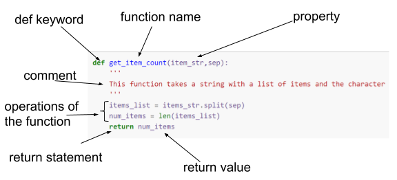

## Defining a function

We have already made use of several Python built-in functions like `print`, `list`, and `range`. But in addition to the functions provided by Python, you can write your own as well. Functions are used when a section of code needs to be repeated several times in a program, it saves you rewriting it. In reality, you rarely need to repeat the _exact same_ code. Usually there will be some variation, for example in the variables the code needs to be run on. Because of this, when you create a function you are allowed to specify a set of `parameters` or arguments to the function.

When we used the `print` function we provided the text we wanted to `print` as a `parameter`. Typically whenever we use the `print` function, we pass a different `parameter` value. The ability to specify parameters make functions very flexible.

~~~
def get_item_count(items_str,sep):
    '''
    This function takes a string with a list of items and the character that separates the items, and returns the number of items in the list
    '''
    items_list = items_str.split(sep)
    num_items = len(items_list)
    return num_items

items_owned = "bicycle;television;solar_panel;table"
print(get_item_count(items_owned,';'))
~~~
{: .language-python}

~~~
4
~~~
{: .output}

Points to note:

1. The definition of a function (or procedure) starts with the keyword _def_ and is followed by the name you wish to give to the function, with any parameters used by the function in between parentheses.
2. The definition clause ends in`:` which causes indentation on the next and subsequent lines. All of these lines are the statements which make up the function. The function ends where the indentation ends.
3. Within the function, the parameters behave as variables whose initial values will be those that were given when the function was called.
4. Functions usually "return" something, which is the result of the procedure applied to the parameters, and is the value assigned to the variable on the left-hand side of the call to the function. This is specified using the `return` keyword.
5. You call (run the code) of a function by providing its name and values for its parameters, the same way you would for any built-in function.
6. Once the definition of the function has been executed, it becomes part of Python for the current session and can be used anywhere.
7. At the beginning of the function code we have a multiline `comment` denoted by the `'''` at the beginning and end. This kind of comment is known as a `docstring` and can be used anywhere in Python code as a documentation aid. It is particularly common, and indeed best practice, to use them to give a brief description of the function. This is because this description will be displayed along with the parameters when you use the help() function or `shift` + `tab` in Jupyter.
8. Variables that are defined within a function only exist within the function itself, they cannot be used outside in the main program.

Our `get_item_count` function has two parameters which must be provided every time the function is called. You need to provide the parameters in the right order or to explicitly name the parameter you are referring to and use the `=` sign to give it a value.

In many cases, there is a value for a certain parameter that is more likely than others. In that case the value can be set as "default", and that is the value that will be taken if the user does not specify a value.

~~~
def get_item_count(items_str, sep=';'):
    '''
    This function takes a string with a list of items and the character that they're separated by and returns the number of items
    '''
    items_list = items_str.split(sep)
    num_items = len(items_list)
    return num_items

print(get_item_count(items_owned)) # Note that the separator is not specified
~~~
{: .language-python}

~~~
4
~~~
{: .output}

The only change we have made is to provide a default value for the `sep` parameter. Now if the user does not provide a value, then the value _;_ will be used. Because `items_str` is the first parameter, we can specify its value by position, without having to explicitly name it, but it could be clearer to explicitly name all parameters.

~~~
print(get_item_count(items_owned, sep = ','))
print(get_item_count(items_str = items_owned, sep=';'))
~~~
{: .language-python}

~~~
1
4
~~~
{: .output}

> ## Volume of a cube
>
> 1. Write a function definition to calculate the volume of a cuboid. The function requires three parameters: height (`h`), width (`w`),
> and length (`len`); and returns the volume.
>
> 2. Suppose that in addition to the volume I also wanted to calculate the surface area and the sum of all of the edges. Would I (or should I) have three separate functions or could I write a single function to provide all three values together?
>
> > ## Solution
> > 1. A function to calculate the volume of a cuboid could be:
> > 
> > ~~~
> > def calculate_vol_cuboid(h, w, len):
> >     """
> >     Calculates the volume of a cuboid.
> >     Takes in h, w, and len that represent height, width, and length of the cube, and returns the volume.
> >     """
> >     volume = h * w * len
> >     return volume
> > ~~~
> > {: .language-python}
> > 2. It depends. As a rule-of-thumb, functions should __do one thing and one thing only, and do it well.__
> > If we always have to calculate these three pieces of information together, the 'one thing' could be
> > 'calculate the volume, surface area, and sum of all edges of a cube'. In that case, our function could look like this:
> >
> > ~~~
> > # Method 1 - single function
> > def calculate_cuboid_metrics(h, w, len):
> >     """
> >     Calculates information about a cuboid defined by the dimensions h(eight), w(idth), and len(gth).
> > 
> >     Returns the volume, surface area, and sum of edges of the cuboid.
> >     """
> >     volume = h * w * len
> >     surface_area = 2 * (h * w + h * len + len * w)
> >     edges = 4 * (h + w + len)
> >     return volume, surface_area, edges
> > ~~~
> > {: .language-python}
> >
> > It may be better, however, to break our function down: one for each piece of information we are
> > calculating. Our functions would look like this:
> > ~~~
> > # Method 2 - separate functions
> > def calc_volume_cuboid(h, w, len):
> >     """
> >     Calculates the volume of a cuboid defined by the dimensions h(eight), w(idth), and len(gth).
> >     """
> >     volume = h * w * len
> >     return volume
> > 
> > 
> > def calc_surface_area_cuboid(h, w, len):
> >     """
> >     Calculates the surface area of a cuboid defined by the dimensions h(eight), w(idth), and len(gth).
> >     """   
> >     surface_area = 2 * (h * w + h * len + len * w)
> >     return surface_area
> > 
> > 
> > def calc_sum_of_edges_cuboid(h, w, len):
> >     """
> >     Calculates the sum of edges of a cuboid defined by the dimensions h(eight), w(idth), and len(gth).
> >     """   
> >     sum_of_edges = 4 * (h + w + len)
> >     return sum_of_edges
> > ~~~
> > {: .language-python}
> > 
> > We could then rewrite our first function that calculates all metrics:
> > ~~~
> > def calc_cuboid_metrics(h, w, len):
> >     """
> >     Calculates information about a cuboid defined by the dimensions h(eight), w(idth), and len(gth).
> > 
> >     Returns the volume, surface area, and sum of edges of the cuboid.
> >     """
> >     volume = calc_volume_cuboid(h, w, len)
> >     surface_area = calc_surface_area_cuboid(h, w, len)
> >     edges = calc_sum_of_edges_cuboid(h, w, len)
> > 
> >     return volume, surface_area, edges
> > ~~~
> > {: .language-python}
> >
> {: .solution}
{: .challenge}

## Using libraries

The functions we have created above only exist within the Jupyter notebook in which they have been defined, and only for the duration of the session. If you start a new Jupyter notebook you will have to copy and paste the functions in to define them again. If all of your code is in a single file or notebook this isn't really a problem. But if your project gets larger, it can be hard to keep track of where each function is saved. 

There are many (thousands) of useful functions which other people have written and have made available to all Python users by creating libraries (also referred to as packages or modules) of functions. You can find out more about existing Python packages by visiting [pypi.org/](https://pypi.org/).

There are several ways to install third party packages to be able to use them in your own code. If you have Python 3.4 or later, it includes by default a package installer called [pip](https://pypi.org/project/pip/), which can be used to install packages. From a Jupyter notebook, you would use the syntax:

~~~
!pip install <package_name>
~~~
{: .language-python}

After installing the package, you still need to "import" the package into your notebook to be able to use the functions contained within the package. This is done by running:

~~~
import <package_name>
~~~
{: .language-python}

As all of these packages are produced by third parties independently of each other, there is the strong possibility that there may be clashes in function names, this is there are functions in two different packages that have the exact same name. Therefore, when you are calling a function from a package that you have imported, you can prefix the function name with the package name, which makes it clear which function you are expecting to run. This can make for long-winded function names, though! The `import` statement allows you to also specify an "alias" for the package, which you must then use instead of the full package name. For example:

~~~
import numpy as np
~~~
{: .language-python}

Many aliases (specified after the `as` keyword) are nearly universally adopted conventions used for very popular libraries, and you will almost certainly come across them when searching for example code. In future lessons, we will be importing the `csv`, `json`, `pandas`, `numpy`, and `matplotlib` modules, which we will describe as we use them. The code that we will use to import these packages is:

~~~
import csv
import json
import pandas as pd
import numpy as np
import matplotlib.pyplot as plt
~~~
{: .language-python}

Matplotlib is a very large library broken up into what can be thought of as sub-libraries. As we will only be using the functions contained in the `pyplot` sub-library we can specify that explicitly when we import. This saves time and space, and does not affect how we call the functions in our code.
