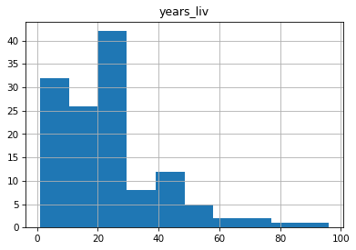
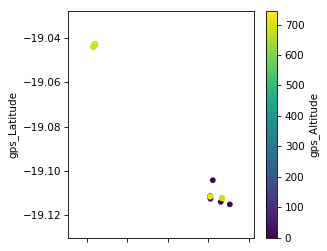
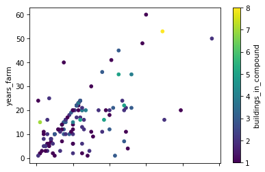
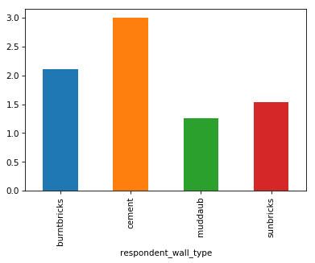
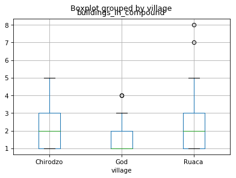
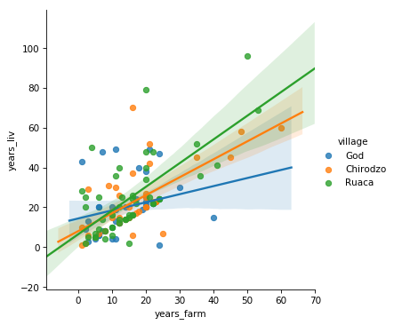

## Plotting in python

There is a wide variety of ways to plot in python, like many programming languages.  Some do more of the design work for you and others let you customize the look of the plots and all of the little details yourself. 

`Matplotlib` is a Python graphical library that can be used to produce a variety of different graph types, it is fully controllable down to basic elements and includes a module `pylab` that is somewhere in between (designed to feel like matlab plotting, if you happen to have done that before).

The `pandas` library contains very tight integration with `matplotlib`. There are functions in `pandas` that automatically call `matplotlib` functions to produce graphs.

Other graphical libraries available from within Python are for example `plotnine` (a ggplot2 realisation for python) and `seaborn`. [`Seaborn`](https://seaborn.pydata.org) has some very powerful features and advancecd plot types. One of its most useful features is formatting.

## Plotting with Pandas

To plot with `pandas` we have to import it as we have done in past episodes.  
To tell Jupyter that when we produce a graph we want it to be displayed in a cell in the notebook just like any other results, we use the `%matplotlib inline` directive. Without that we need to do a `show()` command.

~~~
import pandas as pd
%matplotlib inline
~~~
{: .language-python}

We also need data to work with loaded into a DataFrame and it's helpful to look at a few rows to remember what's there.

~~~
safi_df = pd.read_csv("data/SAFI_full_shortname.csv")
df.head()
~~~
{: .language-python}

Next, we can plot the histogram of a variable

~~~
safi_df['years_liv'].hist()
~~~
{: .language-python}

We can change the number of bins to make it look how we would like, for example

~~~
safi_df['years_liv'].hist(bins=20)
~~~
{: .language-python}

We can also specify the column as a parameter and a groupby column with the `by` keyword. there are a lot of keywords available to make it look better, we can see some of the most likely ones (as decided by `pandas` developers) by using <kbd>shift</kbd> + <kbd>tab</kbd>. Let's try `layout`, `figsize`, and `sharex`.

~~~
safi_df.hist(column='years_liv',by='village',layout=(1,3),figsize=(12,3),sharex=True)
~~~
{: .language-python}

## Scatter plot

The scatter plot requires the x and y coordinates of each of the points being plotted. We can add a third dimension as different colors with the `c` argument.

~~~
safi_df.plot.scatter(x='gps_Latitude', y='gps_Longitude', c='gps_Altitude', colormap="viridis", figsize=[4,4])
~~~
{: .language-python}

> ## Exercise
> 1. Make a scatter plot of `years_farm` vs `years_liv` and color the points by `buildings_in_compound`
> 2. Make a bar plot of the mean number of rooms per wall type
>
> extension: try plotting by wall and roof type?
>
> > ## Solution
> > For the scatter plot:
> > 
> > ~~~
> > safi_df.plot.scatter(x = 'years_liv', y = 'years_farm', c = 'buildings_in_compound', colormap = 'viridis')
> > ~~~
> > {: .language-python}
> > 
> >
> > For the barplot: we first need to calculate the mean value of rooms per wall type, then we can make the plot.
> > 
> > ~~~
> > rooms_mean = safi_df.groupby('respondent_wall_type').mean()['rooms']
> > rooms_mean.plot.bar()
> > ~~~
> > {: .language-python}
> > 
> {: .solution}
{: .challenge}

## Boxplot

A boxplot provides a simple representation of a variety of statistical qualities of a single set of data values.
A common use of the boxplot is to compare the statistical variations across a set of variables.

The variables can be an independent series or columns of a Dataframe using the pandas plot method

~~~
safi_df.boxplot(by = 'village', column = 'buildings_in_compound')
~~~
{:.language-python}

We can make it look prettier with `seaborn`, much more easily than fixing components manually with `matplotlib`. [`Seaborn`](https://seaborn.pydata.org) is a Python data visualization library based on `matplotlib`. It provides a high-level interface for drawing attractive and informative statistical graphics. `Seaborn` comes with Anaconda; to make it available in our python session we need to import it. 

~~~
import seaborn as sns
sns.boxplot(data = safi_df, x = 'village', y = 'buildings_in_compound')
~~~
{: .language-python}

We can also draw linear models in a plot using `lmplot()` from `seaborn`, e.g. for `years_farm` vs `years_liv` per `village`.

~~~
sns.lmplot(data=safi_df, x='years_farm', y='years_liv', hue='village')
~~~
{: .language-python}

## Customising our plots with Matplotlib

We can further customise our plots with `matplotlib` directly. First we need to import it. 
The `matplotlib` library can be imported using any of the import techniques we have seen. As `pandas` is generally imported with `import pandas as pd`, you will find that `matplotlib` is most commonly imported with `import matplotlib.pylab as plt` where `plt` is the alias.

~~~
import matplotlib.pyplot as plt
~~~
{: .language-python}

Let's redo the boxplot we did above:

~~~
df_safi.boxplot(column = 'buildings_in_compound', by = 'village')
~~~
{: .language-python}

The automatic title of the plot does not look good, we are missing a title for the y-axis and we do not need the extra x-axis title. We can also remove the gridlines. Let's fix these things using functions from `plt`. Note: all the adjustments for the plot have to go into the same notebook cell together with the plot statement itself. 

~~~
df_safi.boxplot(column = 'buildings_in_compound', by = 'village')
plt.suptitle('') # remove the automatic title
plt.title('Buildings in compounds per village')   # add a title
plt.ylabel('Number of buildings')   # add a y-axis title
plt.xlabel('')   # remove the x-axis title
plt.grid(None)   # remove the grid lines
~~~
{: .language-python}

In general most graphs can be broken down into a series of elements which, although typically related in some way, can all exist independently of each other. This allows us to create the graph in a rather piecemeal fashion. 
The labels (if any) on the x and y axis are independent of the data values being represented. The title and the legend are also independent objects within the overall graph. 
In `matplotlib` you create the graph by providing values for all of the individual components you choose to include. 

## Saving a graph

If you wish to save your graph as an image you can do so using the `plt.savefig()` function. The image can be saved as a pdf, jpg or png file by changing the file extension. `plt.savefig()` needs to be called at the end of all your plot statements in the same notebook cell.

~~~
df_safi.boxplot(column = 'buildings_in_compound', by = 'village')
plt.suptitle('') # remove the automatic title
plt.title('Buildings in compounds per village')   # add a title
plt.ylabel('Number of buildings')   # add a y-axis title
plt.xlabel('')   # remove the x-axis title
plt.grid(None)   # remove the grid lines
plt.savefig('safi_boxplot_buildings.pdf')   # save as pdf file
plt.savefig('safi_boxplot_buildings.png', dpi = 150)  # save as png file, some extra arguments are provided
~~~
{: .language-python}

> ## Exercise
>
> Revisit your favorite plot we've made so far, or make one with your own data then:
>
> 1. add axes labels
> 2. add a title
> 3. add a legend
> 4. save it in two different formats
>
> extension: try plotting by wall and roof type!
>
{: .challenge}

